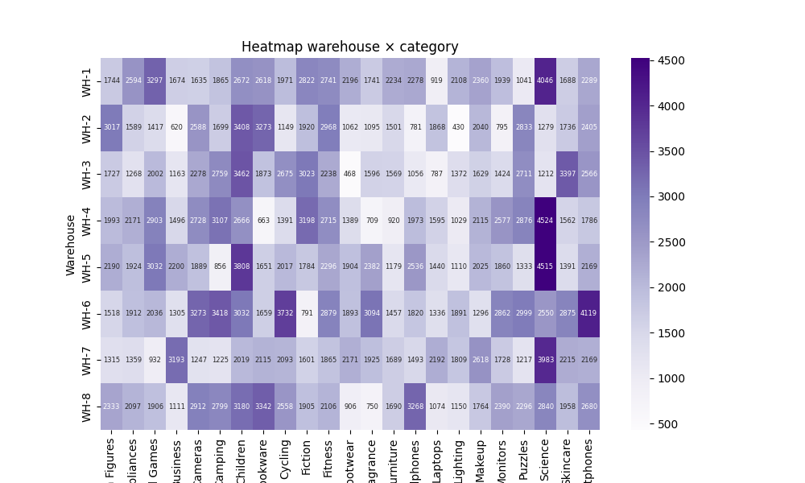
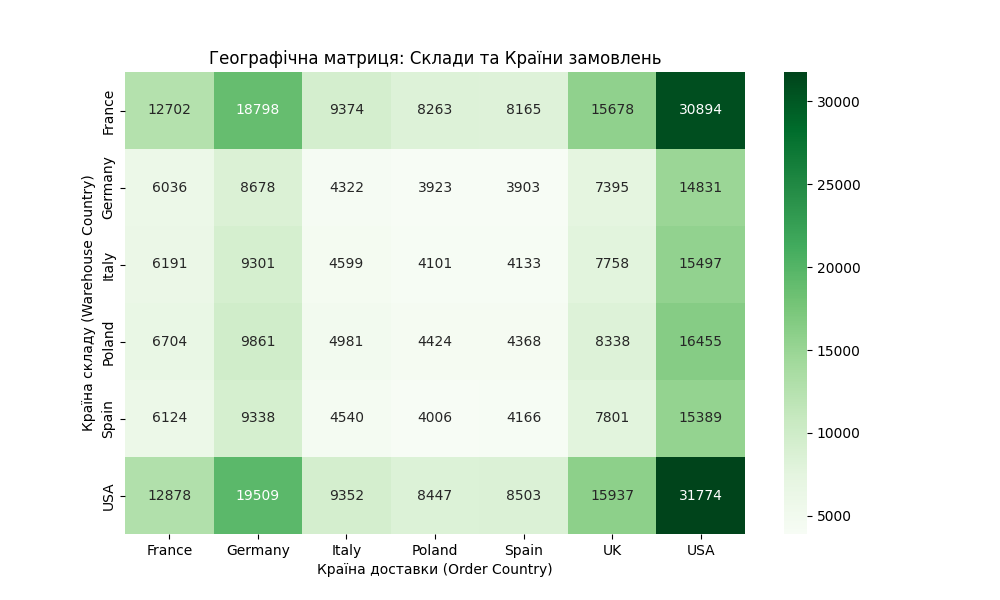
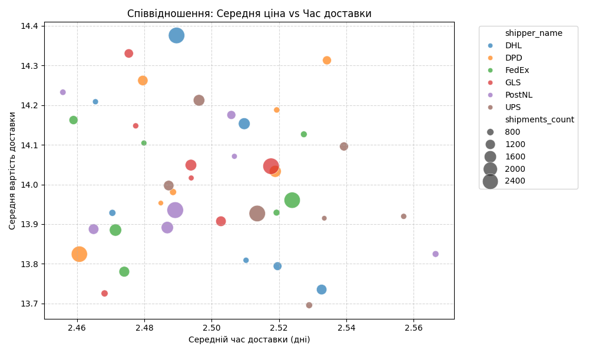

# 📊 Стратегічний звіт: Оптимізація логістики та складських залишків

Цей проєкт реалізує комплексну аналітичну систему інтернет-магазину на основі бази даних `online_store.db`. Мета аналізу — знайти приховані фінансові втрати в ланцюгах постачання, оцінити ефективність перевізників та виявити дисбаланси в управлінні запасами для прийняття точних бізнес-рішень.

---

## 🚚 1. Аудит ефективності перевізників (Вартість vs Швидкість)

Досліджено баланс між витратами на доставку та її швидкістю у розрізі країн збуту. 

### 💡 Бізнес-висновки:
* **Компроміс «Ціна-Час»:** Статистичний аналіз підтверджує, що найдешевші перевізники часто мають найдовший термін виконання замовлень. 
* **Стратегічна рекомендація:** Впровадити автоматичну **гібридну модель вибору контрагента**:
  1. Для *стандартних замовлень* — система автоматично призначає перевізника з мінімальним тарифом.
  2. Для *термінових або преміум-замовлень* — обирається найшвидший експрес-перевізник, а додаткові витрати автоматично закладаються в чек клієнта.
* **ТОП-10 маршрутів:** Виділено ключові географічні напрямки за кількістю відправлень для укладання ексклюзивних довгострокових контрактів зі знижками.

### 📊 Візуалізація аналізу перевізників:
Графік розсіювання (Scatter Plot) демонструє співвідношення ціни та швидкості, де розмір точок відображає обсяг замовлень:



---

## 🏢 2. Аналіз завантаженості та спеціалізації складів

За допомогою теплових карт (Heatmaps) проаналізовано сумарну кількість одиниць продукції на кожному логістичному комплексі у розрізі товарних категорій.

### 💡 Бізнес-висновки:
* **Ризики гіперспеціалізації:** Виявлено розподільчі центри, де частка однієї товарної категорії перевищує безпечні операційні ліміти (понад 60-70% від загального обсягу складу).
* **Стратегічна рекомендація:** Провести диверсифікацію складських площ. У разі сезонного падіння попиту на домінуючу категорію, склад зазнає збитків через простоювання площ. Потрібно перерозподілити інші типи товарів для збалансування завантаженості.

### 📊 Візуалізація розподілу категорій по складах:
Тепла карта наочно підсвічує критичні зони накопичення залишків (від зеленого до червоного кольору):



---

## ⚖️ 3. Географічний розрив: Попит vs Запаси

Побудовано порівняльний аналіз фактичної кількості замовлень покупців (Попит) та обсягу товарів, що зберігаються на складах усередині кожної країни (Запаси).

### 💡 Бізнес-висновки:
* **Критичний дисбаланс:** Графік чітко візуалізує географічний розрив. У деяких регіонах обсяг залишків на складах суттєво перевищує локальний попит. Це означає, що компанія несе подвійні збитки: за тривале зберігання «мертвого вантажу» в одному місці та за дорогу транскордонну логістику під час доставки в інші країни.
* **Стратегічна рекомендація:** Перемістити надлишкові запаси ближче до реальних центрів споживання (ринків збуту) для зниження витрат на «останню милю» та скорочення часу очікування клієнтами.

### 📊 Візуалізація географічного дисбалансу:
Порівняльні стовпчики чітко вказують на регіони, де логістична модель потребує негайного коригування:



---

## 🛠️ Інструкція із запуску для аналітиків

1. Переконайтеся, що файл бази даних `online_store.db` знаходиться в одній папці зі скриптами.
2. Встановіть необхідні залежності:
   ```bash
   pip install pandas matplotlib seaborn numpy
